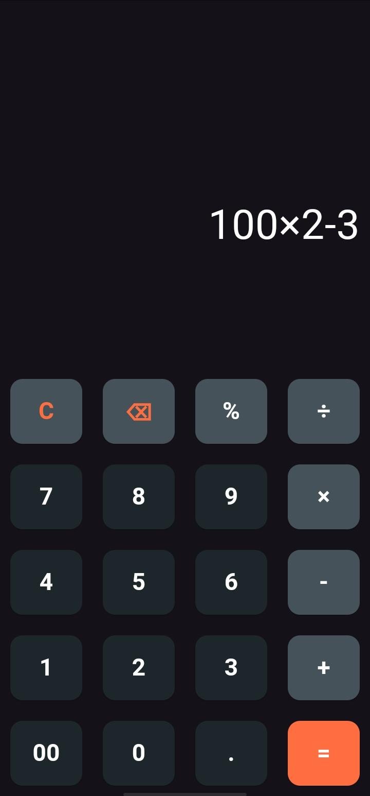
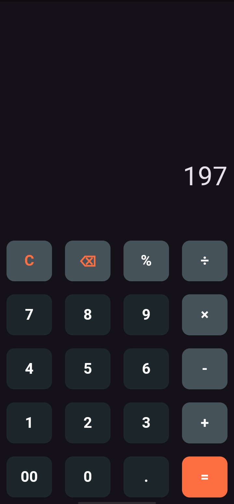

# Modern Flutter Calculator

A sleek, minimal, and premium dark-themed calculator application built with Flutter. It combines a beautiful dark slate design with rich features, interactive buttons, and real-time live mathematical evaluations.
<div align="center">
  <table>
    <tr>
      <td align="center">
        <br/>
        <sub><b>Input Screen</b></sub>
      </td>
      <td align="center">
        <br/>
        <sub><b>Output Screen</b></sub>
      </td>
    </tr>
  </table>
</div>

---

## Features

- **Live Expression Evaluation**: Computes and displays the output in real-time as you type, before you even press the equals (`=`) button.
- **Smart Operator Validation**:
  - Prevents consecutive invalid operators (e.g., prevents entering `++`, `×+`, `÷×`, etc.).
  - Smart negation handling: allows using `-` for negative numbers but prevents invalid repetitions like `--`.
  - Smart decimal points: prevents starting an expression directly with `.` (automatically formats it to `0.`) and blocks multiple decimal points in a single operand.
- **Percent (%) Support**:
  - Handles percentages within addition and subtraction operations (e.g., `100 - 10%` evaluates to `90`).
  - Handles percentages within multiplication and division operations (e.g., `100 × 5%` evaluates to `5`).
  - Supports basic standalone percentages (e.g., `5%` evaluates to `0.05`).
- **Robust Math Parsing**: Powered by the robust `math_expressions` parser for order-of-operations compliance.
- **Division by Zero Protection**: Gracefully catches division by zero errors and displays `Error` without crashing.
- **Elegant Premium Dark Theme**: Crafted with custom rounded buttons, vibrant accent states, and clean typography.

---

## Color Palette & UI Guidelines

The interface utilizes a sleek dark-slate design system to maximize readability and contrast:

- **Keypad Background**: Dark Slate/Charcoal `Color.fromARGB(255, 28, 38, 43)`
- **Operator Buttons**: Muted Blue-Grey `Color.fromARGB(255, 69, 82, 89)`
- **Primary Action / Equals Key**: Deep Orange Accent `Colors.deepOrangeAccent`
- **Typography / Text**: Bright White (`Colors.white`) for numbers, and customized colors for buttons.

---

## Tech Stack & Dependencies

- **Framework**: Flutter SDK (Dart)
- **Math Expression Engine**: `math_expressions`

---

## Getting Started

To get a local copy up and running, follow these simple steps:

### Prerequisites
Make sure you have Flutter installed on your machine. You can verify this by running:
```bash
flutter doctor
```

### Installation
1. Clone the repository:
   ```bash
   git clone https://github.com/your-username/Flutter_Calculator.git
   ```
2. Navigate to the project directory:
   ```bash
   cd Flutter_Calculator
   ```
3. Install dependencies:
   ```bash
   flutter pub get
   ```
4. Run the application:
   ```bash
   flutter run
   ```
